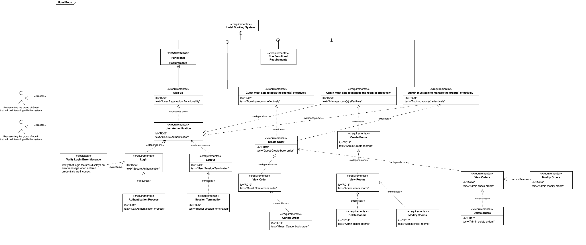

# Hotel Booking System
## Auhor:
- Huixue Han

## Project Description:
This project is a hotel booking system. It is a web application that allows users to book rooms in a hotel.

## Componenets:
- Backend:
  - Node.js
  - Express
  - MongoDB
- Frontend:
  - React.js
  - tailwindcss
  - React Router

## Jira URL:
[https://ictrun.atlassian.net/jira/software/projects/HBS/summary](https://ictrun.atlassian.net/jira/software/projects/HBS/summary)

## Requirement Diagram:

## Origin Requirement:
[Requirements](./requirements.md)